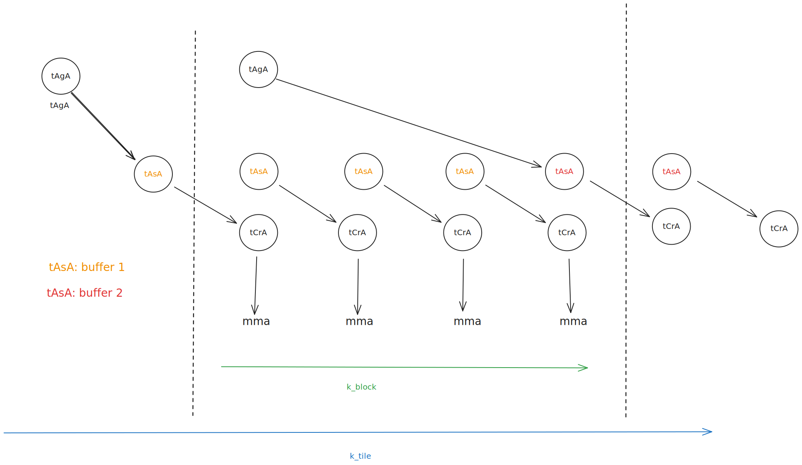

## Overlap global-to-shared copies with mma compute

We can overlap global-to-shared memory copies with mma compute.


To do this we will explicitly load data from shared memory to registers for
the mma computation and submit a new load from global memory to shared memory for the next tile
before compute.

```julia
function matmul_kernel(A, sA_layout, copy_A,
                       B, sB_layout, copy_B,
                       C, mma_C)
    sA = MoYeSharedArray(eltype(A), sA_layout)
    sB = MoYeSharedArray(eltype(B), sB_layout)

    mA = MoYeArray(A)
    mB = MoYeArray(B)
    mC = MoYeArray(C)

    bM = size(sA_layout, 1)
    bN = size(sB_layout, 1)
    bK = size(sB_layout, 2)

    gA = @tile mA (bM, bK) (blockIdx().x, :)
    gB = @tile mB (bN, bK) (blockIdx().y, :)
    gC = @tile mC (bM, bN) (blockIdx().x, blockIdx().y)

    # copy partition
    thr_copy_a = get_slice(copy_A, threadIdx().x)      
    tAgA = partition_S(thr_copy_a, gA)                 # (CPY, CPY_M, CPY_K, k)
    tAsA = partition_D(thr_copy_a, sA)                 # (CPY, CPY_M, CPY_K)

    thr_copy_b = get_slice(copy_B, threadIdx().x)
    tBgB = partition_S(thr_copy_b, gB)                 # (CPY, CPY_N, CPY_K, k)
    tBsB = partition_D(thr_copy_b, sB)                 # (CPY, CPY_N, CPY_K)

    # Copy gmem to smem for k_tile=1
    copyto!(copy_A, tAsA, view(tAgA, :, :, :, _1))
    copyto!(copy_B, tBsB, view(tBgB, :, :, :, _1))

    # mma partition
    thr_mma = get_slice(mma_C, threadIdx().x)
    tCsA = partition_A(thr_mma, sA)                    # (MMA, MMA_M, MMA_K)
    tCsB = partition_B(thr_mma, sB)                    # (MMA, MMA_M, MMA_K)
    tCgC = partition_C(thr_mma, gC)                    # (MMA, MMA_M, MMA_N)

    # mma registers
    tCrA = make_fragment_A(thr_mma, tCsA)                # (MMA, MMA_M, MMA_K)
    tCrB = make_fragment_B(thr_mma, tCsB)                # (MMA, MMA_N, MMA_K)
    tCrC = make_fragment_C(thr_mma, tCgC)                # (MMA, MMA_M, MMA_N)
    zeros!(tCrC)

    k_max = size(tAgA, 4)
    for k in 1:k_max
        cp_async_wait()
        sync_threads()

        # copy from smem to rmem
        copyto!(tCrA, tCsA)
        copyto!(tCrB, tCsB)
        sync_threads()

        if k < k_max
            copyto!(copy_A, tAsA, view(tAgA, :, :, :, k+1))
            copyto!(copy_B, tBsB, view(tBgB, :, :, :, k+1))
        end

        @gc_preserve gemm!(mma_C, tCrC, tCrA, tCrB, tCrC)
    end

    copyto!(tCgC, tCrC)
    return nothing
end
```

## Double buffer

We can also overlap shared-to-registers memory copies with mma compute.

To do this we will need to allocate two shared memory buffers, one for the current compute and one
for the next tile. We prefetch the next tile from global memory to shared memory asynchronously.



```julia
@views function matmul_kernel(A, sA_layout, copy_A,
                              B, sB_layout, copy_B,
                              C, mma_C)
    sA = MoYeSharedArray(eltype(A), sA_layout)        # (bM, bK, 2)
    sB = MoYeSharedArray(eltype(B), sB_layout)        # (bN, bK, 2)

    mA = MoYeArray(A)
    mB = MoYeArray(B)
    mC = MoYeArray(C)

    bM = size(sA_layout, 1)
    bN = size(sB_layout, 1)
    bK = size(sB_layout, 2)

    gA = @tile mA (bM, bK) (blockIdx().x, :)
    gB = @tile mB (bN, bK) (blockIdx().y, :)
    gC = @tile mC (bM, bN) (blockIdx().x, blockIdx().y)

    # copy partition
    thr_copy_a = get_slice(copy_A, threadIdx().x)      
    tAgA = partition_S(thr_copy_a, gA)                 # (CPY, CPY_M, CPY_K, k)
    tAsA = partition_D(thr_copy_a, sA)                 # (CPY, CPY_M, CPY_K, 2)

    thr_copy_b = get_slice(copy_B, threadIdx().x)
    tBgB = partition_S(thr_copy_b, gB)                 # (CPY, CPY_N, CPY_K, k)
    tBsB = partition_D(thr_copy_b, sB)                 # (CPY, CPY_N, CPY_K, 2)

    # Copy gmem to smem for k_tile=1
    copyto!(copy_A, tAsA[:, :, :, 1], tAgA[:, :, :, _1])
    copyto!(copy_B, tBsB[:, :, :, 1], tBgB[:, :, :, _1])

    # mma partition
    thr_mma = get_slice(mma_C, threadIdx().x)
    tCsA = partition_A(thr_mma, sA)                    # (MMA, MMA_M, MMA_K, 2)
    tCsB = partition_B(thr_mma, sB)                    # (MMA, MMA_M, MMA_K, 2)
    tCgC = partition_C(thr_mma, gC)                    # (MMA, MMA_M, MMA_N)

    # mma registers
    tCrA = make_fragment_A(thr_mma, tCsA[:, :, :, _1])    # (MMA, MMA_M, MMA_K)
    tCrB = make_fragment_B(thr_mma, tCsB[:, :, :, _1])    # (MMA, MMA_N, MMA_K)
    tCrC = make_fragment_C(thr_mma, tCgC)                 # (MMA, MMA_M, MMA_N)
    zeros!(tCrC)

    cp_async_wait()
    sync_threads()

    # Copy smem to rmem for k_block=1
    smem_read = 1
    smem_write = 2
    tCsA_p = view(tCsA, :, :, :, smem_read)
    tCsB_p = view(tCsB, :, :, :, smem_read)
    copyto!(tCrA[:, :, 1], tCsA_p[:, :, _1])
    copyto!(tCrB[:, :, 1], tCsB_p[:, :, _1])

    k_tile_max = size(tAgA, 4)
    k_block_max = static_size(tCrA, 3)
    for k_tile in 1:k_tile_max
        @loopinfo unroll for k_block in _1:k_block_max
            k_block_next = k_block + 1 
            if k_block == k_block_max
                cp_async_wait()
                sync_threads()
                tCsA_p = view(tCsA, :, :, :, smem_read)
                tCsB_p = view(tCsB, :, :, :, smem_read)
                k_block_next = 1
            end
            
            copyto!(tCrA[:, :, k_block_next], tCsA_p[:, :, k_block_next])
            copyto!(tCrB[:, :, k_block_next], tCsB_p[:, :, k_block_next])   

            if k_block == _1 && k_tile<k_tile_max
                copyto!(copy_A, tAsA[:, :, :, smem_write], tAgA[:, :, :, k_tile+1])
                copyto!(copy_B, tBsB[:, :, :, smem_write], tBgB[:, :, :, k_tile+1])
                smem_read, smem_write = smem_write, smem_read
            end
            
            @gc_preserve gemm!(mma_C, tCrC, tCrA[:, :, k_block], tCrB[:, :, k_block], tCrC)
        end
    end

    copyto!(tCgC, tCrC)
    return nothing
end

function matmul(A, B, C)
    bM = _128
    bN = _128
    bK = _8
    
    sA_layout = make_layout((bM, bK, _2), (_1, bM + _2, (bM + _2) * bK))
    sB_layout = make_layout((bN, bK, _2), (_1, bN + _2, (bN + _2) * bK))

    TA = eltype(A)
    TB = eltype(B)
    TC = eltype(C)
	
    copy_A = make_tiled_copy(CopyAtom{CPOP_ASYNC_CACHEALWAYS{Float64}, TA}(),
                             @Layout((32, 8)),
                             @Layout((2, 1)))
    copy_B = make_tiled_copy(CopyAtom{CPOP_ASYNC_CACHEALWAYS{Float64}, TB}(),
                             @Layout((32, 8)),
                             @Layout((2, 1)))

    mma_C = make_tiled_mma(UniversalFMA{TA,TB, TC}(), # MMA operation
                           @Layout((32, 8)))          # Atom layout

    threads = Int(size(mma_C))
    blocks = (cld(size(A, 1), bM), cld(size(B, 1), bN))

    @cuda threads=threads blocks=blocks matmul_kernel(A, sA_layout, copy_A,
                                                      B, sB_layout, copy_B,
                                                      C, mma_C)
end

function test()
    A =  CUDA.randn(Float32, 2048, 256)
    B =  CUDA.randn(Float32, 2048, 256)
    C =  CUDA.randn(Float32, 2048, 2048)
    matmul(A, B, C)
    CUDA.synchronize()
    @test C == A * B'
    CUDA.unsafe_free!(A)
    CUDA.unsafe_free!(B)
    CUDA.unsafe_free!(C)
end

test()
```
