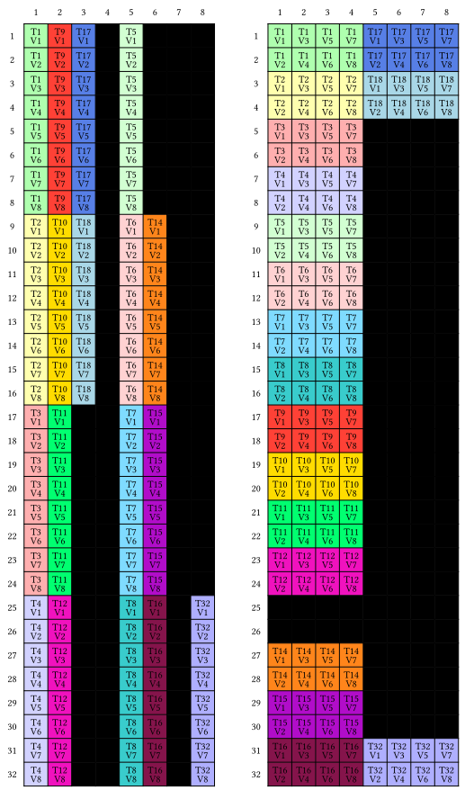

Tiled Copy

We have already introduced how to copy data using @tile and @partition. This process might still appear somewhat cumbersome, and `TiledCopy` serves to simplify it.

Consider the following example where we employ six threads to transfer an array src of shape (4, 9) into another array dst with the identical shape. The relationship mapping logic coordinates to thread IDs can be visualized as:

```julia
1 1 1 2 2 2 3 3 3
1 1 1 2 2 2 3 3 3
4 4 4 5 5 5 6 6 6
4 4 4 5 5 5 6 6 6
```
Here, each thread is assigned a data segment defined by the layout (2,3):(1,2). The group of threads operates within a layout of (2,3):(3,1), referred to as `val_layout` and `thr_layout`, respectively.

To begin, we initialize these arrays:

```@repl tiled_copy
using MoYe
src_buffer = collect(1:36) .* 0.1;
src = MoYeArray(src_buffer, @Layout((4,9)))
dst_buffer = zeros(36);
dst = MoYeArray(dst_buffer, make_layout((_4,_9)));
```

We then proceed to set up a `TiledCopy`:
```@repl tiled_copy
thr_layout = @Layout (2, 3) (3, 1)
val_layout = @Layout (2, 3) (1, 2)
tiled_copy = make_tiled_copy(
	CopyAtom{UniversalCopy{Float64}, Float64}(),
	thr_layout, 
	val_layout)
```

The second parameter Float64 in CopyAtom indicates that the copied data is of `Float64` type. `UniversalCopy{Float64}` is used for vectorized copy operations, meaning that the data is recast to Float64, i.e., without vectorization. You can also use `UniversalCopy{UInt128}` to enable vectoried load and stores.

You can visualize this TiledCopy by using `print_typst(tiled_copy)`. Visit [typst](https://typst.app), copy the printed string, and you will see the following image:


The two tables respectively represent the thread distribution of src and dst, which are the same here. There are also some PTX instructions involved in reallocating each thread's data, for example:
```julia
print_typst(make_tiled_copy(MoYe.CopyAtom{LDSM_U32x4_N, UInt16}(),
                                          @Layout((16,2)), @Layout((2,4))));

```



As you can see, both thr_layout and val_layout are actually defined on dst.

Returning to our example, after making the TiledCopy, we can use it to partition data.

```@repl tiled_copy
thr_idx = 2;
thr_copy = get_slice(tiled_copy, thr_idx);
dst_t = partition_D(thr_copy, dst);
dst_t.layout
src_t = partition_S(thr_copy, src);
src_t.layout
copyto!(tiled_copy, dst_t, src_t);
dst
```

You can see that the second thread has completed the copy. The shape of `dst_t` is `(CPY, CPY_M, CPY_K)` representing
the the num of values handle by a thread in a single tile, and the demensions tiled in `dst`'s shape. Notably,
the left most mode of `CPY` stands for the number of `vectorized` values. In this case it is 1, but try changing to `UniversalCopy{UInt128}` and see how the result changes.

The NVIDIA Ampere architecture supports cuda::memcpy_async for asynchronously copying data between GPU global memory and shared memory without needing threads to orchestrate the data movement. In previous architectures, copying from global memory to shared memory usually involved registers for intermediation, corresponding to this syntax:
```@repl tiled_copy
thr_idx = 3;
thr_copy = get_slice(tiled_copy, thr_idx);
dst_t = partition_D(thr_copy, dst);
src_t = partition_S(thr_copy, src);

dst_r = make_fragment_like(dst_t);
copyto!(tiled_copy, dst_r, src_t);
copyto!(tiled_copy, dst_t, dst_r);
dst
```

## TiledMMA

In this section, we'll show you how to use `TiledMMA` to replace an mma partition. First, invoke the function make_tiled_mma as follows:
```@repl tiled_copy
mma_C = make_tiled_mma(UniversalFMA{TA,TB, TC}(), # MMA operation
                       @Layout((16,16)))          # Atom layout

```

You can experiment with replacing `UniversalFMA` with another `MMAOp` and use print_typst to view the results. Here are the predefined MMAOps:
```@repl tiled_copy
MoYe.mma_ops_list
```

```julia
thr_mma = get_slice(mma_C, threadIdx().x);
tCsA = partition_A(sA);
tCsB = partition_B(sB);
tCgC = partition_C(gC);

tCrC = make_fragment_like(tCgC)
```
These instructions operate on tensor cores, a topic we haven't covered yet (but will soon!).

## MatMul

Now, we use `TiledCopy` and `TiledMMA` to upgrade the previous matmul_kernel.

```julia
function matmul_kernel(A, sA_layout, copy_A,
                       B, sB_layout, copy_B,
                       C, mma_C)
    M = size(A, 1)
    N = size(B, 1)
    K = size(A, 2)

    bM = size(sA_layout, 1)
    bN = size(sB_layout, 1)
    bK = size(sB_layout, 2)

    sA = MoYeSharedArray(eltype(A), sA_layout)
    sB = MoYeSharedArray(eltype(B), sB_layout)

    mA = MoYeArray(A, (M, K))
    mB = MoYeArray(B, (N, K))
    mC = MoYeArray(C, (M, N))

    gA = @tile mA (bM, bK) (blockIdx().x, :)
    gB = @tile mB (bN, bK) (blockIdx().y, :)
    gC = @tile mC (bM, bN) (blockIdx().x, blockIdx().y)

    # copy partition
    thr_copy_a = get_slice(copy_A, threadIdx().x)      
    tAgA = partition_S(thr_copy_a, gA)                 # (CPY, CPY_M, CPY_K, k)
    tAsA = partition_D(thr_copy_a, sA)                 # (CPY, CPY_M, CPY_K)
    tArA = make_fragment_like(tAsA)                    # (CPY, CPY_M, CPY_K)

    thr_copy_b = get_slice(copy_B, threadIdx().x)
    tBgB = partition_S(thr_copy_b, gB)                 # (CPY, CPY_N, CPY_K, k)
    tBsB = partition_D(thr_copy_b, sB)                 # (CPY, CPY_N, CPY_K)
    tBrB = make_fragment_like(tBsB)                    # (CPY, CPY_N, CPY_K)

    # mma partition
    thr_mma = get_slice(mma_C, threadIdx().x)
    tCsA = partition_A(thr_mma, sA)                    # (MMA, MMA_M, MMA_K)
    tCsB = partition_B(thr_mma, sB)                    # (MMA, MMA_M, MMA_K)
    tCgC = partition_C(thr_mma, gC)                    # (MMA, MMA_M, MMA_N)

    # overlap copy and compute
    copyto!(copy_A, tArA, view(tAgA, :, :, :, 1))
    copyto!(copy_B, tBrB, view(tBgB, :, :, :, 1))

    # accumulator
    tCrC = make_fragment_like(tCgC)
    zeros!(tCrC)

    k_max = size(tAgA, 4)
    for k in 1:k_max
        sync_threads()
        copyto!(tAsA, tArA)
        copyto!(tBsB, tBrB)
        sync_threads()

	    # load the next tile
	    k_next = k < k_max ? k+1 : k
	    copyto!(copy_A, tArA, view(tAgA, :, :, :, k_next))
	    copyto!(copy_B, tBrB, view(tBgB, :, :, :, k_next))

        @gc_preserve gemm!(tCsA, tCsB, tCrC)
    end

    copyto!(tCgC, tCrC)
    return nothing
end


function matmul(A, B, C)
    bM = _128
    bN = _128
    bK = _8
    
    sA_layout = make_layout((bM, bK), (_1, bM + _1))
    sB_layout = make_layout((bN, bK), (_1, bN + _1))

    TA = eltype(A)
    TB = eltype(B)
    TC = eltype(C)
	
    copy_A = make_tiled_copy(CopyAtom{UniversalCopy{TA}, TA}(),
                             @Layout((32, 8)),
                             @Layout((4, 1)))
    copy_B = make_tiled_copy(CopyAtom{UniversalCopy{TB}, TB}(),
                             @Layout((32, 8)),
                             @Layout((4, 1)))

    mma_C = make_tiled_mma(UniversalFMA{TA,TB, TC}(), # MMA operation
                           @Layout((16,16)))          # Atom layout

    threads = Int(size(mma_C))
    blocks = (cld(size(A, 1), bM), cld(size(B, 1), bN))

    @cuda threads=threads blocks=blocks matmul_kernel(A, sA_layout, copy_A,
                                                      B, sB_layout, copy_B,
                                                      C, mma_C)
end

function test()
    A =  CUDA.randn(Float32, 2048, 256)
    B =  CUDA.randn(Float32, 2048, 256)
    C =  CUDA.randn(Float32, 2048, 2048)
    matmul(A, B, C)
    CUDA.synchronize()
    @test C == A * B'
    CUDA.unsafe_free!(A)
    CUDA.unsafe_free!(B)
    CUDA.unsafe_free!(C)
end

test()
```
